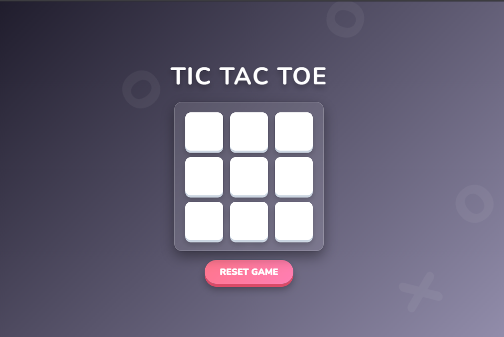

# ❌🅾️ 3D Interactive Tic-Tac-Toe Game

A classic, modern, and fully responsive **Tic-Tac-Toe game** built using **HTML5, CSS3, and JavaScript**. Play against a friend locally with a newly upgraded 3D user interface, smooth animations, and a vibrant neon aesthetic.

---

## 🚀 Features

- **3D Tactile Buttons:** Interactive game grid boxes and buttons that physically press down on click using CSS depths.
- **Glassmorphism Design:** A beautiful frosted-glass game board hovering over a deep gradient space.
- **Ambient Animations:** Floating 'X' and 'O' shapes in the background to ensure a highly dynamic and engaging environment.
- **Neon Highlights:** Vibrant player colors (Neon Pink for X, Neon Cyan for O) for maximum contrast.
- **Pop-In Win Screen:** Smooth, blurred glassmorphism overlay that pops in to announce the winner.
- **Instant Reset:** A dedicated 3D button to quickly clear the board and start a new match.

---

## 🛠️ Tech Stack

- **HTML5:** Structured the game board grid and background animation containers.
- **CSS3:** Advanced Flexbox/Grid layouts, CSS Keyframe animations, 3D `box-shadow` depth techniques, and Glassmorphism (`backdrop-filter`).
- **JavaScript (ES6):** Implemented game-state management, winning-logic validation, and event handling.

---

## 📸 Demo



---

## 📂 Project Structure

```text
├── index.html      # Game board structure & floating background elements
├── style.css       # 3D visuals, glassmorphism styles, and animations
└── script.js       # Game logic and win validation
```
