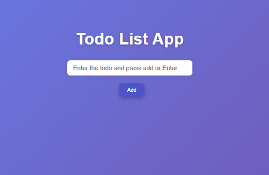

# ❌🅾️ Interactive Tic-Tac-Toe Game

A classic, modern, and fully responsive **Tic-Tac-Toe game** built using **HTML5, CSS3, and JavaScript**. Play against a friend locally with fluid animations, win-streak indicators, and a beautiful user interface.

---

## 🚀 Features

- **Turn Indicators:** Clear visual feedback showing whose turn (X or O) it currently is.
- **Win/Tie Animations:** Highlights the winning combination on the grid with interactive effects.
- **Instant Reset:** A dedicated button to quickly clear the board and start a new match.
- **Responsive Layout:** Perfectly sized grids that adjust seamlessly for mobile, tablet, and desktop screens.

---

## 🛠️ Tech Stack

- **HTML5:** Structured the game board grid and control buttons.
- **CSS3:** Flexbox layout, dynamic hover animations, and custom typography.
- **JavaScript (ES6):** Implemented game-state management, winning-logic validation, and event handling.

---

## 📸 Demo



---

## 📂 Project Structure

```text
├── index.html      # Game board structure
├── style.css       # Visual styles and animations
└── script.js       # Game logic and win validation
```
